# Tutorial: Spatial Room Impulse Response T60 Augmentation

In this tutorial, we cover sound decay time augmentation of spatial room impulse responses (SRIRs) from our paper 
>Yuancheng Luo, "Fast Time-Varying Exponentiated Convolution Methods for Generative Direction Dependent Reverberation", Proceedings of the 161th Audio Engineering Society Convention.

The high-level steps are as follows:
* [Sampling T60 from Gaussian Processes (GPs):](#sampling-t60-functions-from-gaussian-processes) Sample or design a sound decay time function $T_{60}(\omega, \theta, \phi)$ of angular frequency $\omega$, and spherical coordinates $(\theta, \phi)$ co-latitude and azimuth respectively
	* [GP prior mean specifications](#mean-function-prior-specifications)
    * [GP prior covariance specifications](#covariance-function-prior-specifications)
    * [Drawing T60 samples from GP prior and posterior distributions](#sampling-from-gp-prior-and-posterior-distributions)
    * [Optimizing GP covariance hyper parameters](#optimizing-gaussian-process-covariance-function-hyper-parameters)
* [Exponentiating FIR Optimization:](#fitting-exponentiating-fir-to-t60-functions) Fit short finite impulse response (FIR) exponentiating filters $\bf{g}$ to sampled $T_{60}(\omega, \theta, \phi)$ functions
* [Generating and Augmenting SRIRs:](#generating-and-augmenting-colorless-spatial-room-impulse-responses) Generate colorless SRIRs $\bf{h}$ and apply time-varying exponentiated convolution $\textbf{f} = f(\bf{g}, \bf{h})$
  * [Spherical Harmonic Echo Density Model](#spherical-harmonic-echo-density-profile-model)
  * [Spherical Harmonic Image-Source Model](#spherical-harmonic-image-source-model)


## Sampling T60 Functions from Gaussian Processes
We can sample smooth T60 functions $T_{60}(\omega, \theta, \phi)$ of frequency and spherical coordinates from Gaussian processes defined by prior mean function $\overline{T}_{60}(\omega)$, prior covariance function $k(\bf{x},\bf{x}')$, and observed log-T60 times $\bf{y} = [y_1, … , y_S]$ at $\bf{X} = \left \lbrace \bf{x}_1, …, \bf{x}_S \right \rbrace$ given by

$$y_n = \log \left ( T_{60}(\underline{\omega_n}, \underline{\theta_n}, \underline{\phi_n} ) \right ) - \log \left ( \overline{T}_{60}(\underline{\omega_n}) \right ), \quad  \bf{x}_n = (\underline{\omega_n}, \underline{\theta_n}, \underline{\phi_n}).
$$

The supported mean and covariance functions are specified as follows:

### Mean Function Prior Specifications

A simple T60 prior mean is the power law function given by

$$\overline{T}_{60}(\omega) =  \alpha  \max \left ( 1, \nu(\omega)  \right ) ^{-\beta}, \quad \nu(\omega) = \frac{\omega}{2 \pi}, $$

where $\alpha$ is the T60 (seconds) at 0 Hz, $\beta$ is the decay exponent, and $\nu(\omega)$ is ordinary frequency. Increasing the decay rate $\beta$ inflects the T60 curve towards 0 seconds for larger frequencies in the following figure: 

```
gp_plt('mu_pow');
```
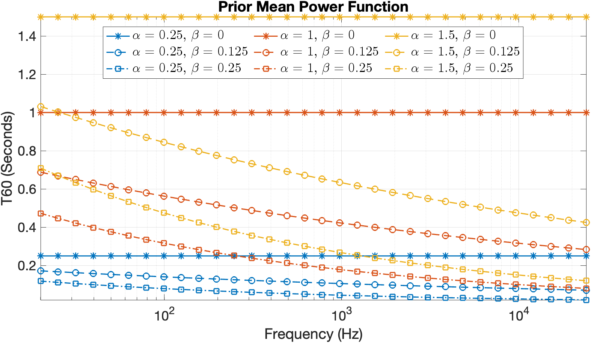

The power law function is monotonic decreasing for positive $\beta$ and whose derivative converges to $0$ for increasing frequency. We can introduce a 3rd shape parameter to control the tilt following an idealized low-pass filter response design given by

$$\overline{T}_{60}(\omega) =  \frac{\alpha}{1 + \left ( \frac{\nu(\omega)}{f_c}  \right )^{\beta}}, $$

where $f_c$ is the cross-over frequency relative to the flat T60 curve $(\beta = 0)$ where the absolute derivative is maximal, as shown in the following figures:

```
gp_plt('mu_lpf');
```
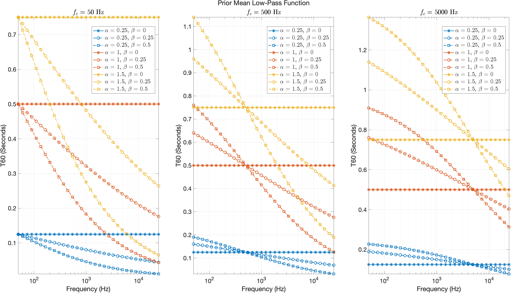

The GP prior mean function can be evaluated via `gp_mu.m` by specifying its options struct `gp_mu_opts.m` and plotted:
```
omega = 2 * pi * logspace(log10(20), log10(24000), 256)'; % Angular frequencies

mu_power = gp_mu(omega, gp_mu_opts('mu_func', 'power', 'mu_alpha', 1, 'mu_beta', 0.5, 'enable_disp', true));
mu_lpf   = gp_mu(omega, gp_mu_opts('mu_func', 'LPF',   'mu_alpha', 1, 'mu_beta', 0.5, 'mu_fc', 500, 'enable_disp', true));
```

### Covariance Function Prior Specifications

We can construct positive semi-definite covariance functions from chordal distances of spherical coordinates $(\theta, \phi)$, $(\theta’, \phi’)$ and there corresponding unit-directions  $\bf{v}$, $\bf{v}'$  on the unit sphere in $\mathbb{R}^3$ given by 

$$d(\theta, \phi, \theta', \phi') = 2 \sin \left ( \frac{ \left | \cos^{-1} (\bf{v}^T \bf{v}') \right |   }{2} \right ) = \left \lVert \bf{v} - \bf{v}'  \right \rVert_2 .$$

The squared exponential of chordal distance with non-stationary kernel wavelengths is therefore a non-stationary Gaussian kernel[^PACIOREK_NS] in 3-dimensions where $\bf{\Sigma} = \lambda^2 \bf{I} \in \mathbb{R}^{3 \times 3}$, and is positive semi-definite following  

$$k(\bf{x},\bf{x}') = \sigma^2 \left ( \frac{2 \lambda \lambda'}{\lambda^2 + (\lambda')^2} \right )^{3/2} \exp \left (  - \frac{d^2(\theta, \phi, \theta', \phi') }{ \left ( \lambda^2 + (\lambda')^2 \right ) / 2}  \right ),$$

where $\lambda = \ell / f^{\gamma}$ is the scaled wavelength for velocity $\ell$ (m/s), ordinary frequency $f = \angle \omega / (2 \pi)$ (Hz), and power $\gamma$. Increasing the hyper-parameter $\gamma$ decreases the covariance between low and high frequencies of the T60 functions. Therefore, larger $\gamma$ decreases smoothness in high frequency as shown in the following figure:

```
gp_plt('cov_sqx_chw_ns');
```
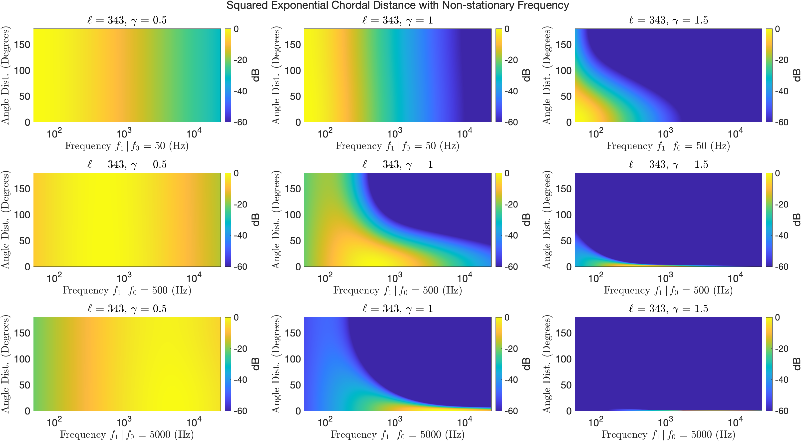

where the maximum covariances occur at $\lambda = \ell / f_0^{\gamma}$ for varying $\lambda' = \ell / f_1^{\gamma}$. The covariance function’s shape follows

* T60 at frequency $f_0$ covaries more with lower frequencies than with higher frequencies given the same angular separation.
* T60s at lower frequencies are smoother than at higher frequencies.


We compare our non-stationary covariance with the stationary product of squared exponential of chordal distance and squared exponential of log-frequency distances given by

$$k(\bf{x},\bf{x}') = \sigma^2 \exp \left (  - \frac{d^2(\theta, \phi, \theta', \phi') }{2 \ell_c^2}  \right )  \exp \left (  - \frac{ \left | log(f) - log(f') \right | ^2 }{2 \ell_f^2}  \right ) ,$$

where $\ell_c$, $\ell_f$ are length-scale hyper-parameters of the chordal and log-frequency distances respectively. Therefore, the covariance function is stationary w.r.t. the chordal and log-frequency distances as shown in the following figure:

```
gp_plt('cov_sqx_chw_sqx');
```
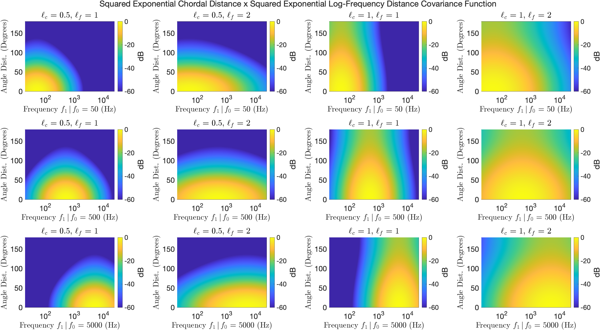

where frequency $f = f_0$ for varying $f' = f_1$. Unlike the non-stationary covariance, the low and high frequencies covary only by their octave separation, and are independent of the absolute frequency.

The GP prior covariance function can be evaluated via `gp_cov.m` by specifying its options struct `gp_cov_opts.m` and plotted:

```
N_B = 16;     % Number of log-uniform angular frequencies
N_E = 20;     % Number of uniform spherical coordinates

omega         = 2 * pi * logspace(log10(20), log10(24000), N_B)';
[theta, phi]  = sh_fib(N_E);
freq          = max(1, omega / (2 * pi)); %[N_B x 1]

freq_grid     = repmat(freq, [1, N_E]);
theta_grid    = repmat(theta', [N_B, 1]);
phi_grid      = repmat(phi', [N_B, 1]);

X = [2 * pi * freq_grid(:), theta_grid(:), phi_grid(:)]; %[N_B * N_E x 1] Input vector

[K, dK_mat_list, dK_name_list] = gp_cov(X, X, gp_cov_opts('cov_func', 'cov_sqx_chw_ns', 'cov_sigma', 1, 'cov_ell', 343, 'cov_gamma', 1, 'enable_disp', true));
[K, dK_mat_list, dK_name_list] = gp_cov(X, X, gp_cov_opts('cov_func', 'cov_sqx_chw_sqx', 'cov_sigma', 1, 'cov_ell_c', 1, 'cov_ell_f', 2, 'enable_disp', true));
```

### Sampling from GP Prior and Posterior Distributions

We can sample T60 functions from either a GP prior or posterior distribution via the function `gp_t60_sample.m`. Let us walk through several cases from the function `plot_gp_T60_prior_post_example.m`.

* Drawing independent and identically distributed (IID) sample log-T60 functions from a GP prior distribution at a common spherical coordinate:
  ```
  %%%%%%%%%%%%%%%%%%%%%%%%%%%%%%%%%%%%%%%%%%%%%%%%%%%%%%%%%%%%%%%%%%%%%%%%%%%
  % Setup GP prior mean and covariance
  %%%%%%%%%%%%%%%%%%%%%%%%%%%%%%%%%%%%%%%%%%%%%%%%%%%%%%%%%%%%%%%%%%%%%%%%%%%
  options_mu  = gp_mu_opts('mu_func', 'power', 'mu_alpha', 1, 'mu_beta', 0.25, 'mu_fc', 8000);
  options_cov = gp_cov_opts('cov_sigma', sqrt(2)/2, 'cov_gamma', 2/3, 'cov_ell', 343 * 1);
  
  %%%%%%%%%%%%%%%%%%%%%%%%%%%%%%%%%%%%%%%%%%%%%%%%%%%%%%%%%%%%%%%%%%%%%%%%%%%
  % Single point spherical coordinate evaluation grid, sampled 4 times, GP prior
  %%%%%%%%%%%%%%%%%%%%%%%%%%%%%%%%%%%%%%%%%%%%%%%%%%%%%%%%%%%%%%%%%%%%%%%%%%%
  Fs = 48000; %Sample rate
  
  % Setup evaluation grid
  N_B = 128; % Number of angular frequencies
  N_E = 1;   % Number of spherical coordinates
  
  omega        = 2 * pi * logspace(log10(20), log10(Fs/2), N_B)';
  [theta, phi] = sh_fib(N_E);
  
  % Sample 4 functions
  num_evals = 4;
  rng(21136 + 12); %Seed RNG
  [log_T60, h_fig_prior] = gp_t60_sample(omega, theta, phi, num_evals, [], ...
          'options_mu', options_mu, 'options_cov', options_cov, ...
          'enable_disp', true, 'options_disp', gp_disp_opts('disp_ylim', [0, 1.75], 'disp_legend_num_cols', 1));
  ```
	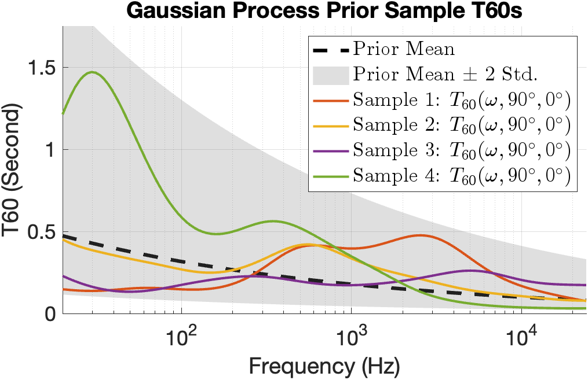

	where by virtue of modeling log-T60 functions, the variance hyper parameter  $\sigma^2$ belonging to the covariance function is multiplicative w.r.t. the prior mean $\overline{T}_{60}(\omega)$, and the sampled functions are non-negative.

* Drawing a single log-T60 field at varying spherical coordinates on the horizontal plane from a GP prior distribution:
  ```
    %%%%%%%%%%%%%%%%%%%%%%%%%%%%%%%%%%%%%%%%%%%%%%%%%%%%%%%%%%%%%%%%%%%%%%%%%%%
    % Azimuth plane spherical coordinate evaluation grid, sampled once, GP prior
    %%%%%%%%%%%%%%%%%%%%%%%%%%%%%%%%%%%%%%%%%%%%%%%%%%%%%%%%%%%%%%%%%%%%%%%%%%%
    % Setup evaluation grid
    N_B = 64;
    omega   = 2 * pi * logspace(log10(20), log10(Fs/2), N_B)';
    phi     = deg2rad([0:30:150])';
    theta   = pi/2 * ones(numel(phi), 1);
    
    % Sample 1 function
    rng(11136 + 13); 
    num_evals = 1;
    [log_T60, h_fig_prior_grid] = gp_t60_sample(omega, theta, phi, num_evals, [], ...
            'options_mu', options_mu, 'options_cov', options_cov, ...
            'enable_disp', true, 'options_disp', gp_disp_opts('disp_ylim', [0, 0.75], 'disp_legend_loc', 'northeast', 'disp_legend_num_cols',  2));
  ```
	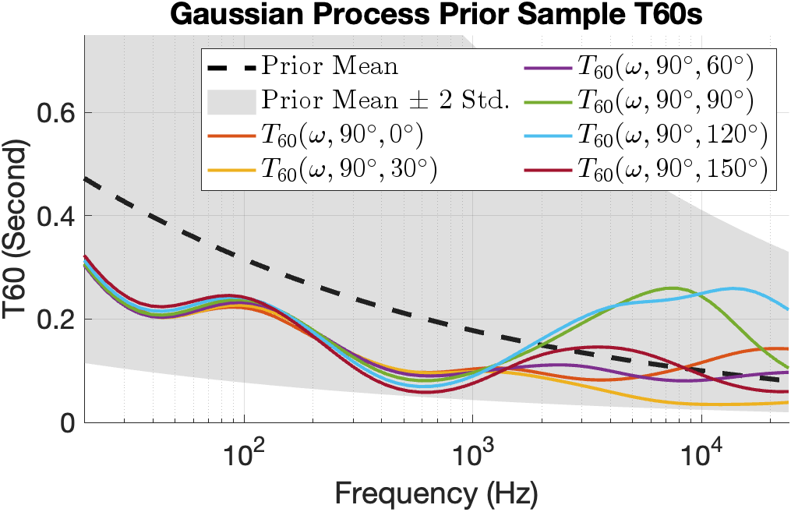

	where the T60s highly covary for lower frequencies by virtue of the non-stationary covariance function. 

* Specifying observed log-T60 via options in `gp_obs_opts.m` and drawing IID log-T60 functions from the GP posterior distribution:
	```
  %%%%%%%%%%%%%%%%%%%%%%%%%%%%%%%%%%%%%%%%%%%%%%%%%%%%%%%%%%%%%%%%%%%%%%%%%%%
  % Single point spherical coordinate evaluation grid, sampled 4 times, GP posterior
  %%%%%%%%%%%%%%%%%%%%%%%%%%%%%%%%%%%%%%%%%%%%%%%%%%%%%%%%%%%%%%%%%%%%%%%%%%%
  % Setup evaluation grid
  N_B = 128;
  N_E = 1;
  omega        =  2 * pi * logspace(log10(20), log10(Fs/2), N_B)';
  [theta, phi] = sh_fib(N_E);
  
  % Observations
  N_S = 3; %3 observations in frequency
  omega_obs = logspace(log10(20), log10(Fs/2), N_S)' * 2 * pi;
  
  obs = gp_obs_opts('omega', omega_obs, ...
                      'theta', theta(1) * ones(N_S, 1), ...
                      'phi', phi(1) * ones(N_S, 1), ...
                      'T60', mu_pow(omega_obs, 2.5, 0.4), ...
                      'log_noise_std', 0.05 * ones(N_S, 1) ... %5 percent
                      );
  
  % Sample function
  rng(21136 + 18);
  num_evals = 4; %Sample 4 functions
  [log_T60, h_fig_post] = gp_t60_sample(omega, theta, phi, num_evals, obs, ...
              'options_mu', options_mu, 'options_cov', options_cov, ...
              'enable_disp', true, 'options_disp', gp_disp_opts('disp_ylim', [0, 1], 'disp_legend_loc', 'northeast', 'disp_legend_num_cols', 1));
    ```
	
	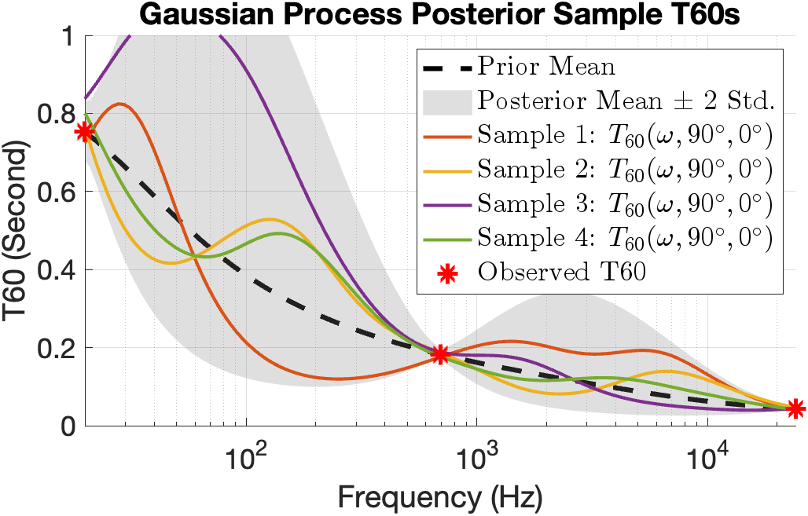

	where `obs` struct contains the three observed log-T60s specified at $[20, 692, 24000]$ Hz on a single spherical coordinate. The sampled log-T60 functions from the GP posterior distribution highly covary at the observed T60 frequencies due to the small log-noise standard deviation specification (5%).

* Drawing a single log-T60 field at varying spherical coordinates on the horizontal plane from a GP posterior distribution:
	```
   %%%%%%%%%%%%%%%%%%%%%%%%%%%%%%%%%%%%%%%%%%%%%%%%%%%%%%%%%%%%%%%%%%%%%%%%%%%%
  % Azimuth plane spherical coordinate evaluation grid, sampled once, GP posterior
  %%%%%%%%%%%%%%%%%%%%%%%%%%%%%%%%%%%%%%%%%%%%%%%%%%%%%%%%%%%%%%%%%%%%%%%%%%%%
  % Setup evaluation grid
  N_B = 64;
  omega   = 2 * pi * logspace(log10(20), log10(Fs/2), N_B)';
  phi     = deg2rad([0:30:150])';
  theta   = pi/2 * ones(numel(phi), 1);
  
  %Observations
  N_S = 3;
  omega_obs = logspace(log10(20), log10(Fs/2), N_S)' * 2 * pi;
  
  obs = gp_obs_opts('omega', omega_obs, ...
                      'theta', deg2rad(90) * ones(N_S, 1), ...
                      'phi', deg2rad(0) * ones(N_S, 1), ...
                      'T60', mu_lpf(omega_obs, 1, 1, 4000), ...
                      'log_noise_std', 0.005 * ones(N_S, 1) ... %0.5 percent
                      );
  
  options_disp_gp = gp_disp_opts('disp_legend_samples', false, ...
      'disp_legend_mean', false, 'disp_legend_var', false, 'disp_legend_loc', 'northeast', ...
      'disp_legend_num_cols', 1, 'disp_ylim', [0, 1.1], ...
      'disp_sample_eval', true, 'disp_mean', false, 'disp_var', true, ...
      'disp_legend_compact', true, 'disp_position', [100, 100, 560 * 0.825, 480 * 0.666], ...
      'disp_legend_transparency', 0.75, 'disp_colororder', 'gem12', ...
      'disp_var_transparency', 0.025, ...
      'disp_sample_stride', 1);
  
  % Sample 1 function
  rng(11136 + 13); 
  num_evals = 1;
  [log_T60, h_fig_posterior_grid] = gp_t60_sample(omega, theta, phi, num_evals, obs, ...
          'options_mu', options_mu, 'options_cov', options_cov, ...
          'enable_disp', true, 'options_disp', options_disp_gp);
    ```
	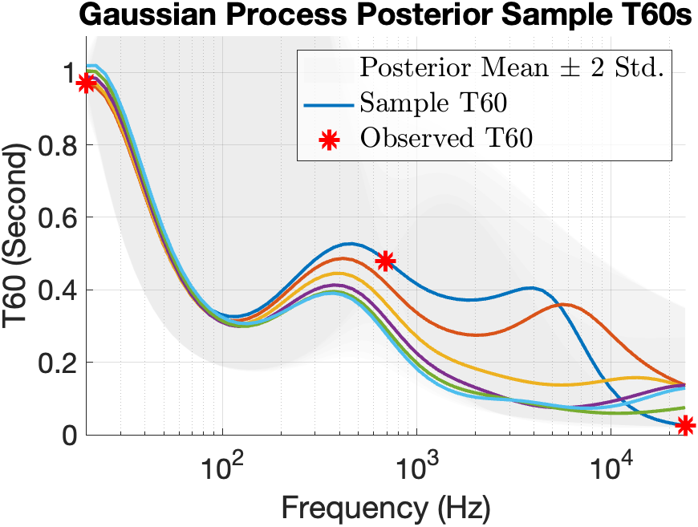

	where the sampled log-T60s revert back to the prior mean function for spherical coordinates far away from the observed coordinates at $(\theta = 90^{\circ}, \phi = 0^{\circ})$.

### Optimizing Gaussian Process Covariance Function Hyper Parameters

We can optimize the covariance function’s hyper parameters by maximizing the marginal data likelihood following the example in `plot_gp_optimize_example.m`. Let us draw some sample log-T60 functions from the following GP prior distribution:

```
%%%%%%%%%%%%%%%%%%%%%%%%%%%%%%%%%%%%%%%%%%%%%%%%%%%%%%%%%%%%%%%%%%%%%%%%%%%
% Setup GP prior mean and covariance
%%%%%%%%%%%%%%%%%%%%%%%%%%%%%%%%%%%%%%%%%%%%%%%%%%%%%%%%%%%%%%%%%%%%%%%%%%%
options_mu  = gp_mu_opts('mu_func', 'power', 'mu_alpha', 1, 'mu_beta', 0.25, 'mu_fc', 8000);
options_cov = gp_cov_opts('cov_func', 'cov_sqx_chw_ns', 'cov_sigma', 0.5, 'cov_gamma', 0.75, 'cov_ell', 2 * 343);

Fs = 48000; %Sample rate

%%%%%%%%%%%%%%%%%%%%%%%%%%%%%%%%%%%%%%%%%%%%%%%%%%%%%%%%%%%%%%%%%%%%%%%%%%%
% Azimuth plane spherical coordinate evaluation grid, sampled once, GP prior
%%%%%%%%%%%%%%%%%%%%%%%%%%%%%%%%%%%%%%%%%%%%%%%%%%%%%%%%%%%%%%%%%%%%%%%%%%%
% Setup evaluation grid
N_B     = 16;
N_E     = 24;
omega   = 2 * pi * logspace(log10(20), log10(Fs/2), N_B)';
[theta, phi] = sh_fib(N_E);

options_disp = gp_disp_opts('disp_ylim', [0, 0.6], 'disp_legend_loc', 'southoutside', ...
    'disp_legend_num_cols',  4, 'disp_legend_compact', true, ...
    'disp_position', [100, 100, 800, 800], 'disp_legend_samples', false);

% Sample 1 field
rng(1213); 
num_evals = 1;

[log_T60, h_fig_prior_grid] = gp_t60_sample(omega, theta, phi, num_evals, [], ...
        'options_mu', options_mu, 'options_cov', options_cov, ...
        'enable_disp', true, 'options_disp', options_disp); % [N_B x N_E x num_evals]
```

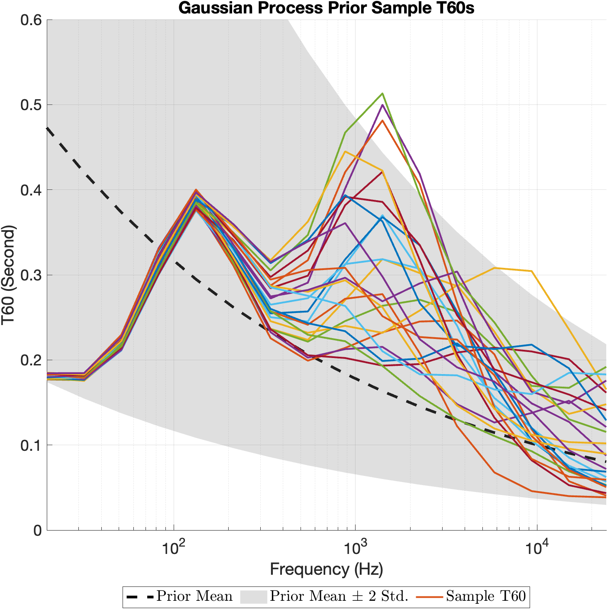

We now specify the drawn samples as the observed log-T60 and maximize the log-marginal likelihood w.r.t. the covariance hyper parameters as follows:

```
%%%%%%%%%%%%%%%%%%%%%%%%%%%%%%%%%%%%%%%%%%%%%%%%%%%%%%%%%%%%%%%%%%%%%%%%%%%
% Specify observations
%%%%%%%%%%%%%%%%%%%%%%%%%%%%%%%%%%%%%%%%%%%%%%%%%%%%%%%%%%%%%%%%%%%%%%%%%%%

omega_grid = repmat(omega, [1, N_E]);
theta_grid = repmat(theta(:)', [N_B, 1]);
phi_grid = repmat(phi(:)', [N_B, 1]);
obs = gp_obs_opts('omega', omega_grid(:), 'theta', theta_grid(:), 'phi', phi_grid(:), 'T60', exp(log_T60(:)), ...
    'log_noise_std', 0.002 * ones(N_B * N_E, 1)); %0.2 percent 

%%%%%%%%%%%%%%%%%%%%%%%%%%%%%%%%%%%%%%%%%%%%%%%%%%%%%%%%%%%%%%%%%%%%%%%%%%%
% Fit covariance hyperparameters
%%%%%%%%%%%%%%%%%%%%%%%%%%%%%%%%%%%%%%%%%%%%%%%%%%%%%%%%%%%%%%%%%%%%%%%%%%%
options_fmincon = optimoptions("fmincon", SpecifyObjectiveGradient=true, Display="iter", checkGradients=false, ...
        ScaleProblem=true, ...
        FunctionTolerance=1e-8, ConstraintTolerance=1e-8, OptimalityTolerance=1e-10, StepTolerance=1e-8, ...
        MaxIterations=1000, MaxFunctionEvaluations=10000);

options_cov_0 = gp_cov_opts('cov_func', 'cov_sqx_chw_ns', ...
    'cov_sigma_lim', [0.2, 2], 'cov_gamma_lim', [0.4, 2], 'cov_ell_lim', [100, 1000]);

options_cov_fit = gp_t60_optimize(obs, 'options_mu', options_mu, 'options_cov', options_cov_0, ... 
    'options_fmincon', options_fmincon, 'num_start', 1);

% Compare covariance hyperparameters in structs
disp([newline, 'Prior cov_sigma: ', num2str(options_cov.cov_sigma)]);
disp(['Prior cov_ell: ', num2str(options_cov.cov_ell)]);
disp(['Prior cov_gamma: ', num2str(options_cov.cov_gamma)]);
```

The optimization converges and the fitted covariance hyper parameters are closer to that of the GP prior where the log-T60 functions were originally drawn as follows:

```
log-marginal likelihood: 1162.794
cov_sigma: 0.50844
cov_ell: 687.5028
cov_gamma: 0.74528

Prior cov_sigma: 0.5
Prior cov_ell: 686
Prior cov_gamma: 0.75
```

A sampled log-T60 field from the GP posterior distribution at twice the number of spherical coordinates and higher frequency resolution yields the following:
```
%%%%%%%%%%%%%%%%%%%%%%%%%%%%%%%%%%%%%%%%%%%%%%%%%%%%%%%%%%%%%%%%%%%%%%%%%%%
% Sample field from posterior distribution
%%%%%%%%%%%%%%%%%%%%%%%%%%%%%%%%%%%%%%%%%%%%%%%%%%%%%%%%%%%%%%%%%%%%%%%%%%%

% Draw sample log-T60 from fitted GP
options_disp_fitted = gp_disp_opts('disp_ylim', [0, 0.6], 'disp_legend_loc', 'southoutside', ...
    'disp_legend_num_cols', 4, 'disp_legend_compact', true, ...
    'disp_position', [100, 100, 800, 800], 'disp_legend_samples', false, ...
    'disp_legend_var', false, 'disp_legend_mean', false, ...
    'disp_marker_size', 4);

omega_fitted = 2 * pi * logspace(log10(20), log10(Fs/2), 100)';
[theta_fitted, phi_fitted] = sh_fib(2 * N_E);

[log_T60_fitted, h_fig_post_grid] = gp_t60_sample(omega_fitted, theta_fitted, phi_fitted, num_evals, obs, ...
    'options_mu', options_mu, 'options_cov', options_cov_fit, ...
    'enable_disp', true, 'options_disp', options_disp_fitted);
```
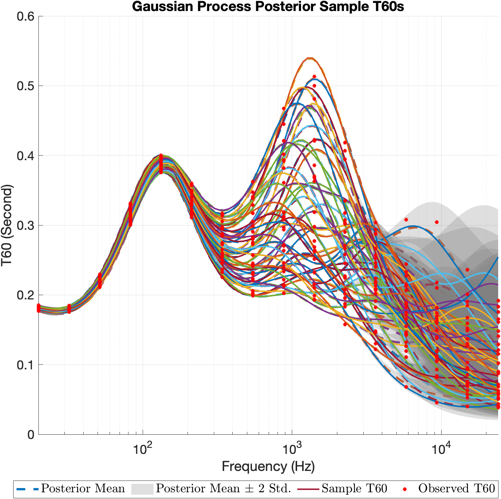


## Fitting Exponentiating FIR to T60 Functions

The desired frequency response  $G(\omega)$  of our exponentiating filter $\bf{g}$ has minimum-phase with magnitude that attenuates by 60 dB under exponentiation by $F_s T_{60}(\omega)$ samples for sampling rate $F_s$. Our target frequency response is given by

$$ |G(\omega)|_{dB} = \frac{-60}{F_s  T_{60}(\omega) }, \quad  \quad \arg [G(\omega)] = \mathcal{H} \lbrace \log |G(\omega)| \rbrace, $$

where $\mathcal{H}$ is the Hilbert transform, and can be found via the real-cepstrum method[^OPPENHEIM_DSP]. In practice, the realized filter’s magnitude frequency response must also be bounded below unity as to remain stable under exponentiation. We therefore minimize the following quadratic objective under quadratic constraints:

$$ \min_{\bf{g}} \int \left \lVert \mathcal{F} \lbrace g[n] \rbrace (\omega) - G(\omega) \right \rVert_2^2 d \omega,  \quad  \left \lVert \mathcal{F} \lbrace g[n] \rbrace (\omega)   \right \rVert_2^2 < 0, $$

which can be expressed as a cone-program after discretizing the Fourier transform $\mathcal{F}$ along uniform spaced angular frequencies between DC and Nyquist. This is implemented in our function `ft_bnd_minphase.m` and `ft_exp_design.m`. As an example, let us specify a simple T60 target over uniform frequencies and fit a 9-tap exponentiating FIR filter with magnitude response bounded below $1-10^{-6}$ as follows:

```
Fs = 48000;

RT60_sec = [4 0.25 4 4 0.5]; % Target RT60 from DC to Nyquist with overshoot 

tol0 = 1e-6;

[g_RT60_9, ~, h_f_9] = ft_exp_design(9, 'RT60',  'enable_disp', true, 'Fs', Fs, 'RT60_sec', RT60_sec, 'tol0', tol0);
h_f_9.Position = [100, 100, 600, 480];
```
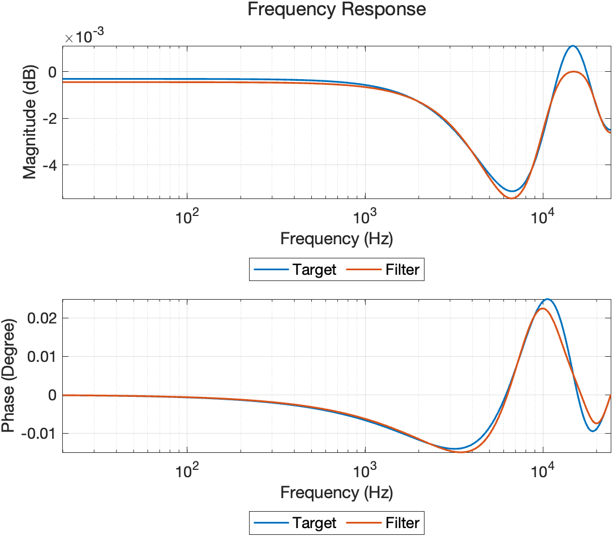

where the target minimum-phase response overshoots $0$ dB in the high-frequency band (14 - 18 kHz). Our optimized exponentiating filter stays below the unity upper bound and is near-minimum phase given equal number of filter taps to minimum-phase target responses.

Let us now combine the GP T60 sampling method from the previous section with our filter fitting method, and apply exponentiating filter to a Gaussian noise sequence in the `plot_gp_T60_exp_fit_example.m` function.

* Sample a log-T60 field from the GP posterior:

  ```
  %%%%%%%%%%%%%%%%%%%%%%%%%%%%%%%%%%%%%%%%%%%%%%%%%%%%%%%%%%%%%%%%%%%%%%%%%%%
  % Setup GP prior mean and covariance
  %%%%%%%%%%%%%%%%%%%%%%%%%%%%%%%%%%%%%%%%%%%%%%%%%%%%%%%%%%%%%%%%%%%%%%%%%%%
  options_mu  = gp_mu_opts('mu_func', 'power', 'mu_alpha', 1, 'mu_beta', 0.25, 'mu_fc', 8000);
  options_cov = gp_cov_opts('cov_sigma', sqrt(2)/2, 'cov_gamma', 2/3, 'cov_ell', 343 * 1);
  
  Fs = 16000;
  
  %%%%%%%%%%%%%%%%%%%%%%%%%%%%%%%%%%%%%%%%%%%%%%%%%%%%%%%%%%%%%%%%%%%%%%%%%%%%
  % Azimuth plane spherical coordinate evaluation grid, sampled once, GP posterior
  %%%%%%%%%%%%%%%%%%%%%%%%%%%%%%%%%%%%%%%%%%%%%%%%%%%%%%%%%%%%%%%%%%%%%%%%%%%%
  % Setup evaluation grid
  N_B = 64;
  N_E = 7;
  f_lo    = 80;
  omega   = 2 * pi * logspace(log10(f_lo), log10(Fs/2), N_B)';
  phi     = deg2rad(linspace(0, 180, N_E))';
  theta   = pi/2 * ones(N_E, 1);
  
  %Observations
  N_S = 3;
  omega_obs = logspace(log10(f_lo), log10(Fs/2), N_S)' * 2 * pi;
  
  obs = gp_obs_opts(  'omega', omega_obs, ...
                      'theta', deg2rad(90) * ones(N_S, 1), ...
                      'phi', deg2rad(0) * ones(N_S, 1), ...
                      'T60', mu_lpf(omega_obs, 1, 1, 4000), ...
                      'log_noise_std', 0.005 * ones(N_S, 1) ... %0.5 percent
                      );
  
  options_disp_gp = gp_disp_opts('disp_xlim', [f_lo inf], 'disp_legend_samples', false, ...
      'disp_legend_mean', false, 'disp_legend_var', false, 'disp_legend_loc', 'southwest', ...
      'disp_legend_num_cols', 1, 'disp_ylim', [0, 1.1], ...
      'disp_sample_eval', true, 'disp_mean', false, 'disp_var', true, ...
      'disp_legend_compact', true, 'disp_position', [100, 100, 560 * 0.825, 480 * 0.666], ...
      'disp_legend_transparency', 0.75, 'disp_colororder', 'gem12', ...
      'disp_var_transparency', 0.025, ...
      'disp_sample_stride', 1);
  
  % Sample 1 function
  rng(1215 + 10); 
  num_evals = 1;
  
  [log_T60, h_fig_posterior_grid] = gp_t60_sample(omega, theta, phi, num_evals, obs, ...
          'options_mu', options_mu, 'options_cov', options_cov, ...
          'enable_disp', true, 'options_disp', options_disp_gp);
  ```
  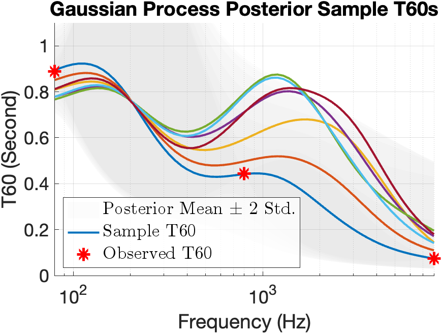

* Interpolate T60 at 32 uniformly spaced frequencies between DC and Nyquist:
  ```
  %%%%%%%%%%%%%%%%%%%%%%%%%%%%%%%%%%%%%%%%%%%%%%%%%%%%%%%%%%%%%%%%%%%%%%%%%%%
  % Uniform frequency interpolation
  %%%%%%%%%%%%%%%%%%%%%%%%%%%%%%%%%%%%%%%%%%%%%%%%%%%%%%%%%%%%%%%%%%%%%%%%%%%
  N_uni = 32;
  omega_uni   = 2 * pi * linspace(0, Fs/2, N_uni)';
  T60_uni_sec = exp(interp1(omega, log_T60, omega_uni, 'pchip'));
  
  fontsize = 16;
  h_fig_posterior_grid_interp1 = figure; 
  semilogx(omega_uni / (2 * pi), T60_uni_sec, 'linewidth', 1.5); 
  grid on; axis tight; 
  xlabel('Frequency (Hz)', 'fontsize', fontsize); ylabel('T60 (Seconds)', 'fontsize', fontsize); 
  title('T60 Interpolation over Uniform Frequencies', 'fontsize', fontsize + 1);
  set(gca, 'fontsize', fontsize - 1);
  legend_str = cell(1, N_E);
  for n = 1:N_E
      legend_str{n} = num2str(n);
  end
  h_lg = legend(legend_str, 'location', 'best'); set(h_lg, 'fontsize', fontsize - 1);
  ```
  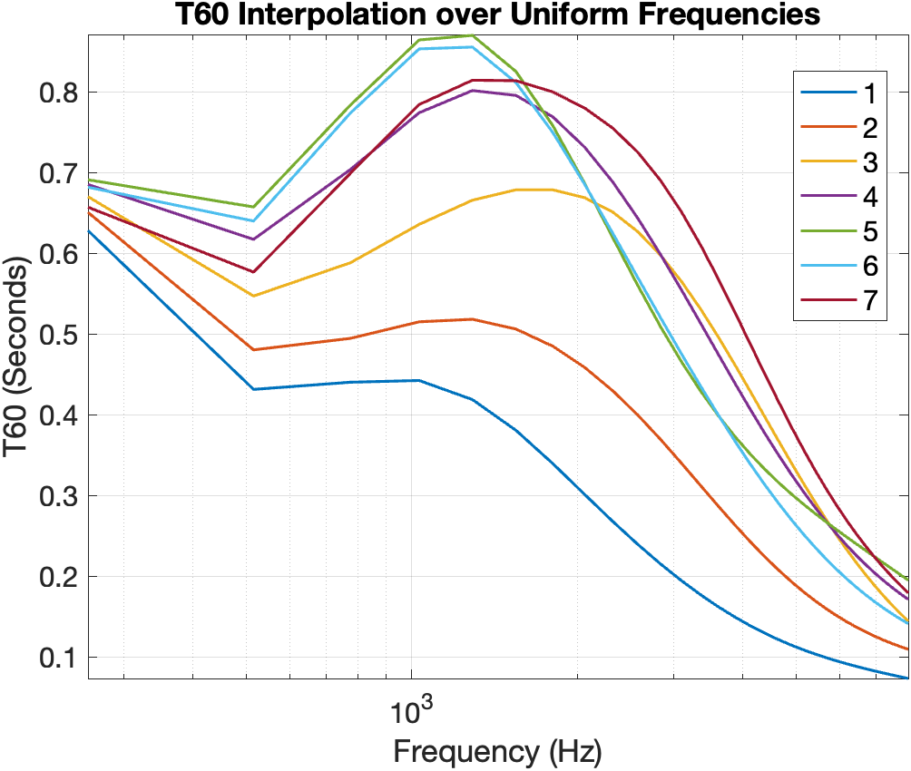

* Filter fit exponentiating filter $\bf{g}$ to the first sampled T60 function:
  ```
  %%%%%%%%%%%%%%%%%%%%%%%%%%%%%%%%%%%%%%%%%%%%%%%%%%%%%%%%%%%%%%%%%%%%%%%%%%%
  % Fit exponentiating filter
  %%%%%%%%%%%%%%%%%%%%%%%%%%%%%%%%%%%%%%%%%%%%%%%%%%%%%%%%%%%%%%%%%%%%%%%%%%%
  N_taps = N_uni;
  tol0 = 1e-6;
  
  g_RT60  = cell(1, N_E);
  g_MP    = cell(1, N_E);
  h_g_fig = cell(1, N_E);
  
  idx_fit = 1;
  [g_RT60{idx_fit}, g_MP{idx_fit}, h_g_fig{idx_fit}] = ft_exp_design(N_taps, 'RT60',  'enable_disp', true, 'Fs', Fs, 'RT60_sec', T60_uni_sec(:, idx_fit), 'tol0', tol0);
  h_g_fig{idx_fit}.Position = [100, 100, 600, 480];
  ```
  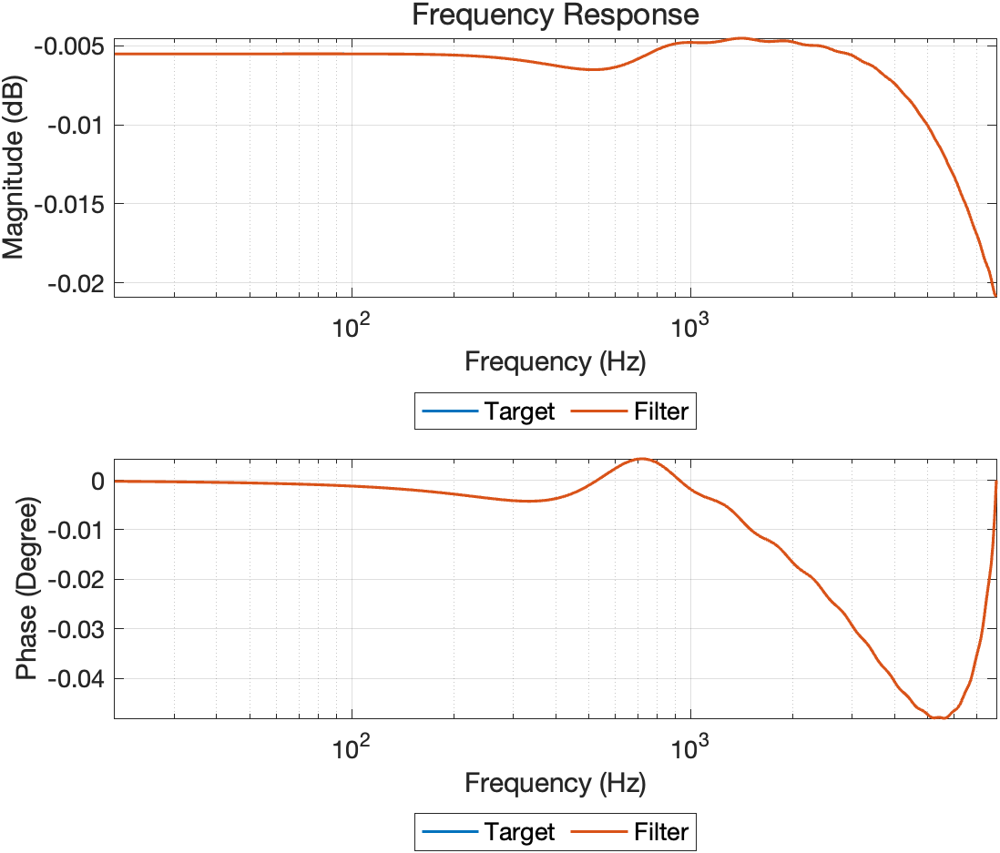

* Generate Gaussian noise impulse response $\bf{h}$ and apply exponentiating filtering $f(\bf{h}, \bf{g})$:
  ```
  %%%%%%%%%%%%%%%%%%%%%%%%%%%%%%%%%%%%%%%%%%%%%%%%%%%%%%%%%%%%%%%%%%%%%%%%%%%
  % Generate noise and filter
  %%%%%%%%%%%%%%%%%%%%%%%%%%%%%%%%%%%%%%%%%%%%%%%%%%%%%%%%%%%%%%%%%%%%%%%%%%%
  rng(521345);
  T = 1; % Duration seconds
  h = randn(1, ceil(T * Fs));
  [f_1, h_f_exp_fig] = ft_exp_conv_opt(h, g_RT60{idx_fit}, ...
      'enable_disp', true, 'Fs', Fs, 'N_FFT', 512);
  ```
    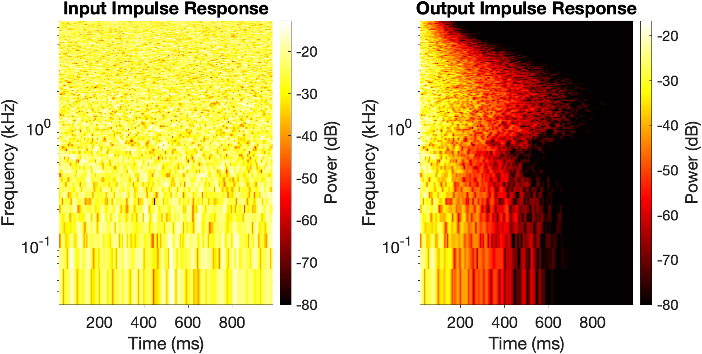
  
## Generating and Augmenting Colorless Spatial Room Impulse Responses

We can generate SRIRs that distribute acoustic echos or reflections over the spherical coordinates. We model the latter via a mixture of weighted surface-delta functions $\delta(\theta, \phi  | \theta', \phi')$ following the expansion of Dirac functions over the spherical harmonic (SH) domain from the delta function’s expansion in the Legendre polynomials and the Legendre addition theorem:

$$\delta(\theta, \phi  |  \theta', \phi') = \sum_{l=0}^{L} \sum_{m=-l}^l Y_l^m (\theta, \phi)  Y_l^{m*} (\theta', \phi'),$$

where $Y_l^m(\theta, \phi)$ are spherical harmonic basis functions of degree $l$, order $m$, and $Y_l^{m*}(\theta', \phi’)$ is the complex conjugate at the spherical coordinate expansion center $(\theta’,\phi')$. Delta functions are subsequently normalized to have unity intensity at their peaks to model unit pulse-trains. Once a pulse-train of SH-SRIR expansions are generated, they can be augmented with different T60 decays sampled from a GP via the function `sh_exp_conv_gp.m`.


### Spherical Harmonic Echo Density Profile Model

The distribution of a room’s echo arrival times given an echo density profile[^ABEL_EDP] can be modeled by a Poisson process[^HUANG_EDP]. We can augment the echo density profile with a probability distribution function (PDF) of the acoustic reflection’s direction in spherical coordinates over time. Valid density functions over the spherical coordinates can be expressed via sum-of-magnitude square SH expansions[^LUO_MAGSQSH]. The SH-Poisson process RIR is implemented in the function `sh_rand_pp.m`.

Let us generate a sample SH-Poisson RIR and augment its T60 in the function `plot_sh_rand_pp_example.m`:

* Specify a square exponential of chordal distance density function centered on $(\theta = \pi/2, \phi = 0)$ with no, linear, and exponential scattering over time:
  ```
  %%%%%%%%%%%%%%%%%%%%%%%%%%%%%%%%%%%%%%%%%%%%%%%%%%%%%%%%%%%%%%%%%%%%%%%%%%%
  % Generate probability density functions over spherical coordinates
  %%%%%%%%%%%%%%%%%%%%%%%%%%%%%%%%%%%%%%%%%%%%%%%%%%%%%%%%%%%%%%%%%%%%%%%%%%%
  max_odr = 12;
  is_real = true;
  
  T	= 0.5;		% Duration
  Fs	= 16000;	% Sample rate
  M	= ceil(T * Fs);	% Number of samples
  
  % Squared exponential of chordal distance radial basis function
  C_pdf = sh_nrm(sh_enc_rbf('SqExp', max_odr, pi/2, 0, 0.25, is_real), 'Sum');
  
  C_pdf = C_pdf * ones(1, M);
  D_lin = sh_pdf_scatter(C_pdf, 'lin', 0.999, is_real);
  D_exp = sh_pdf_scatter(C_pdf, 'exp', 0.999, is_real, 'exp_k', 0.1);
  
  dB_lim = [-40, 20];
  t = (0:(M-1)) / Fs;
  sh_plt(C_pdf, 'horizontal', is_real, 'disp_phase', false, 'title_name_override', 'Squared Exponential Kernel', 'dB_lim', dB_lim, 't', t);
  sh_plt(D_lin, 'horizontal', is_real, 'disp_phase', false, 'title_name_override', 'Linear Scattering', 'dB_lim', dB_lim, 't', t);
  sh_plt(D_exp, 'horizontal', is_real, 'disp_phase', false, 'title_name_override', 'Exponential k = 0.5 Scattering', 'dB_lim', dB_lim, 't', t);
  ```
	| No Scattering | Linear Scattering | Exponential Scattering |
  | --- | --- | --- |
  |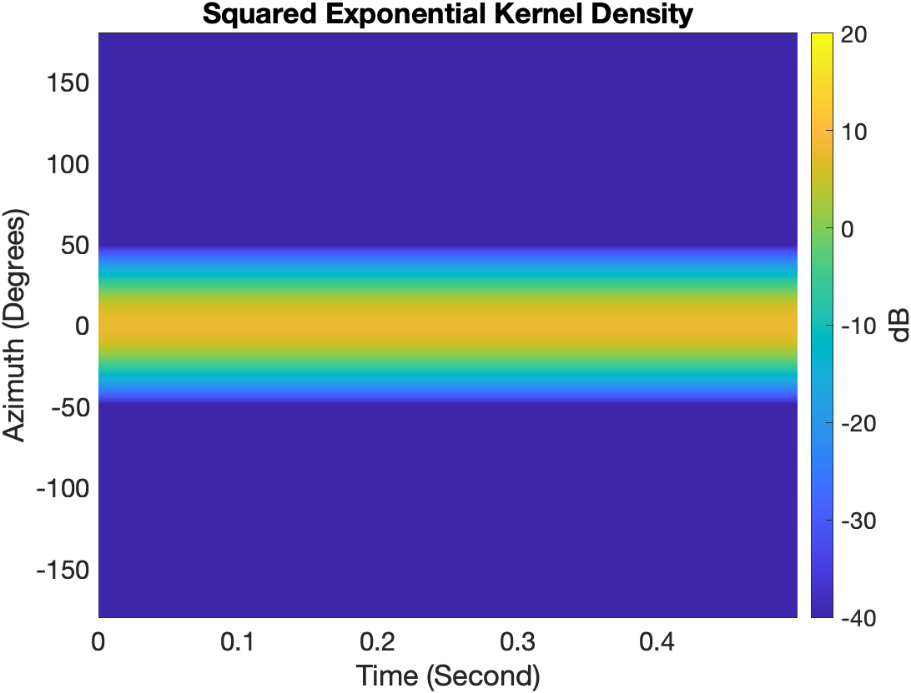|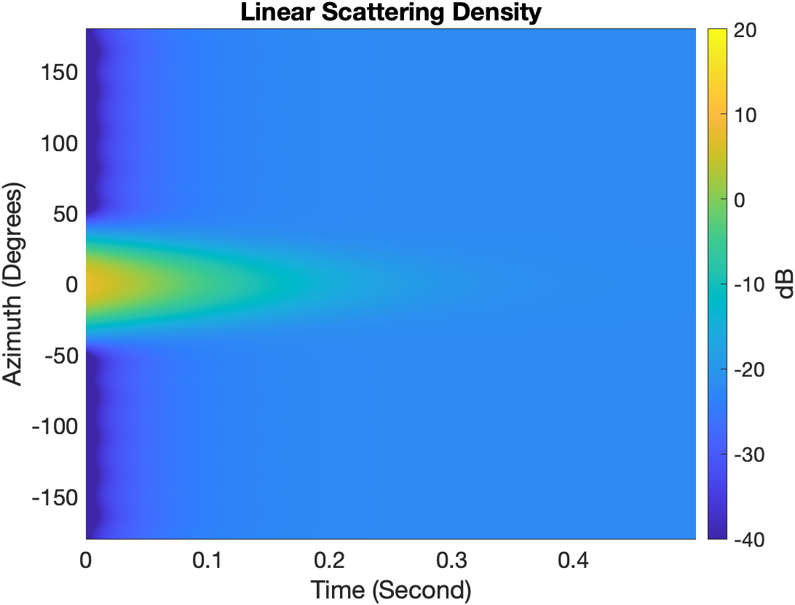|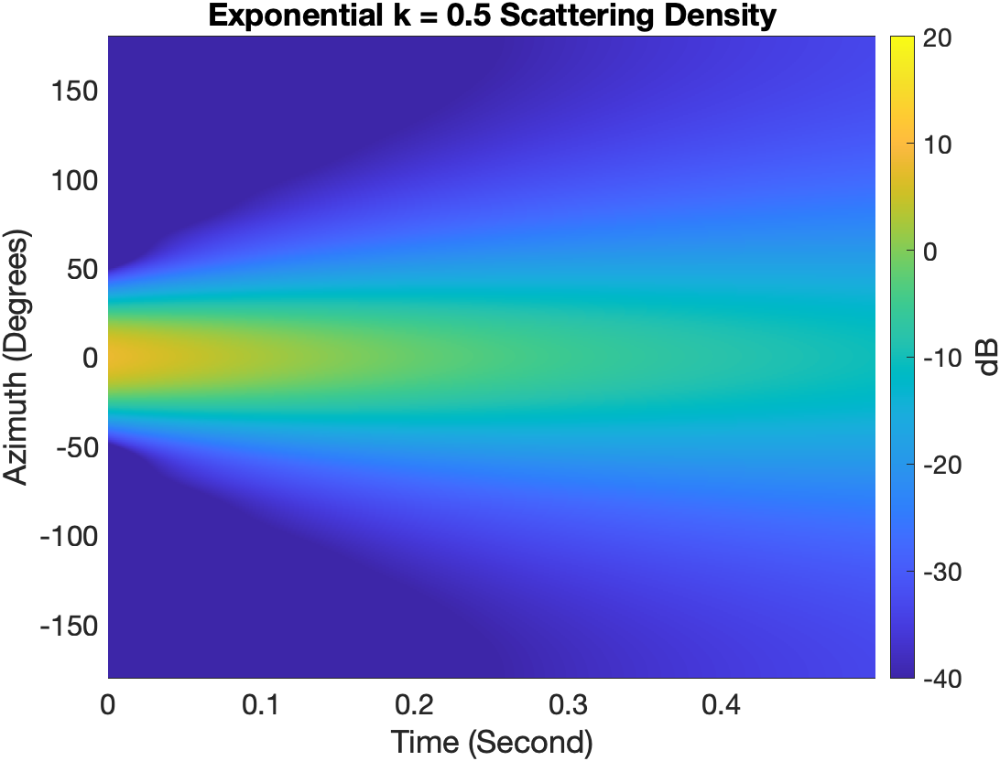|
  
	where no scattering holds the density constant over time, linear scattering mixes with uniform density over time, and exponential scattering transports towards uniform density over time.

* Specify an echo density profile and sample SRIRs:
  ```
  %%%%%%%%%%%%%%%%%%%%%%%%%%%%%%%%%%%%%%%%%%%%%%%%%%%%%%%%%%%%%%%%%%%%%%%%%%%
  % Generate absolute echo density profile and sample spatial RIRs
  %%%%%%%%%%%%%%%%%%%%%%%%%%%%%%%%%%%%%%%%%%%%%%%%%%%%%%%%%%%%%%%%%%%%%%%%%%%
  aed = logspace(log10(10/Fs), log10(2), M) * Fs;
  rseed = 12543 + 7;
  
  rng(rseed);
  [C_pp, t, h_pp] = sh_rand_pp(max_odr, aed, is_real, 'Fs', Fs, ...
      'direct_unity_first_pulse', true, 'C_pdf', C_pdf, 'enable_disp', true);
  
  rng(rseed);
  [C_pp_lin, t, h_pp_lin] = sh_rand_pp(max_odr, aed, is_real, 'Fs', Fs, ...
      'direct_unity_first_pulse', true, 'C_pdf', D_lin, 'enable_disp', true);
  
  rng(rseed);
  [C_pp_exp, t, h_pp_exp] = sh_rand_pp(max_odr, aed, is_real, 'Fs', Fs, ...
      'direct_unity_first_pulse', true, 'C_pdf', D_exp, 'enable_disp', true);
  ```
	| Density | SRIRs Decoded On-Axis | Energy / Time on Horizontal Plane |
  | --- | --- | --- |
  |No Scattering|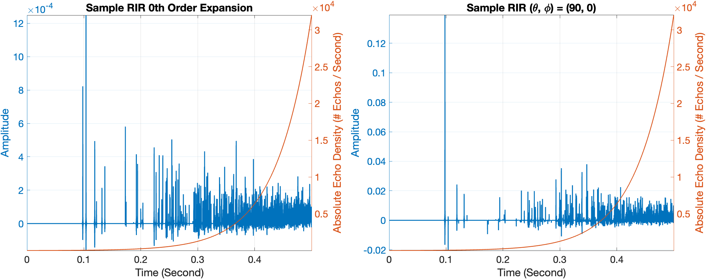|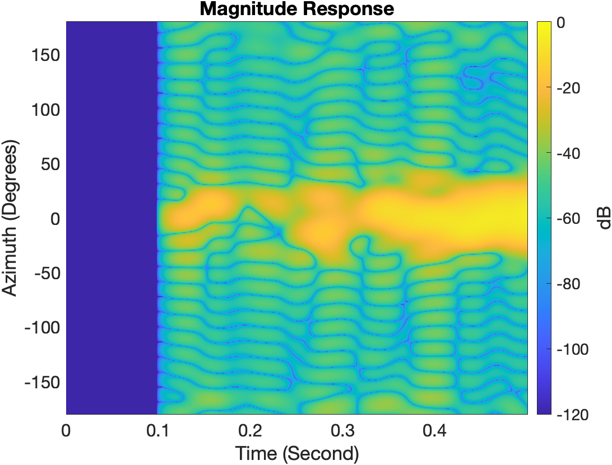|
  |Linear Scattering|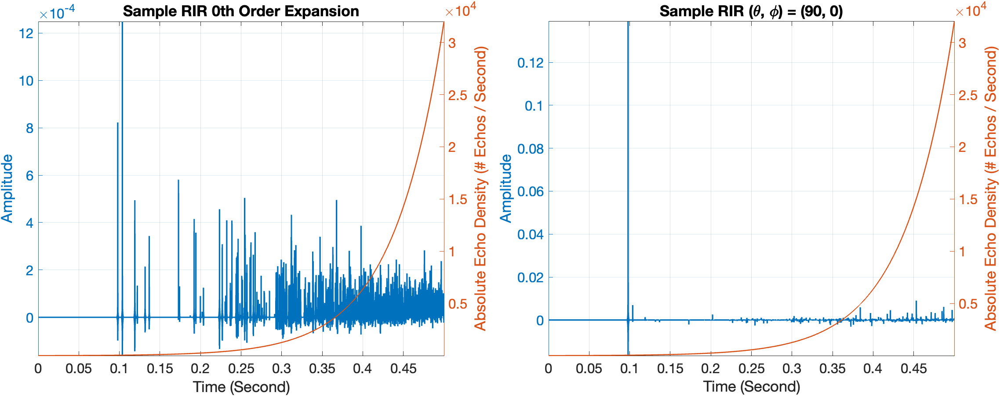|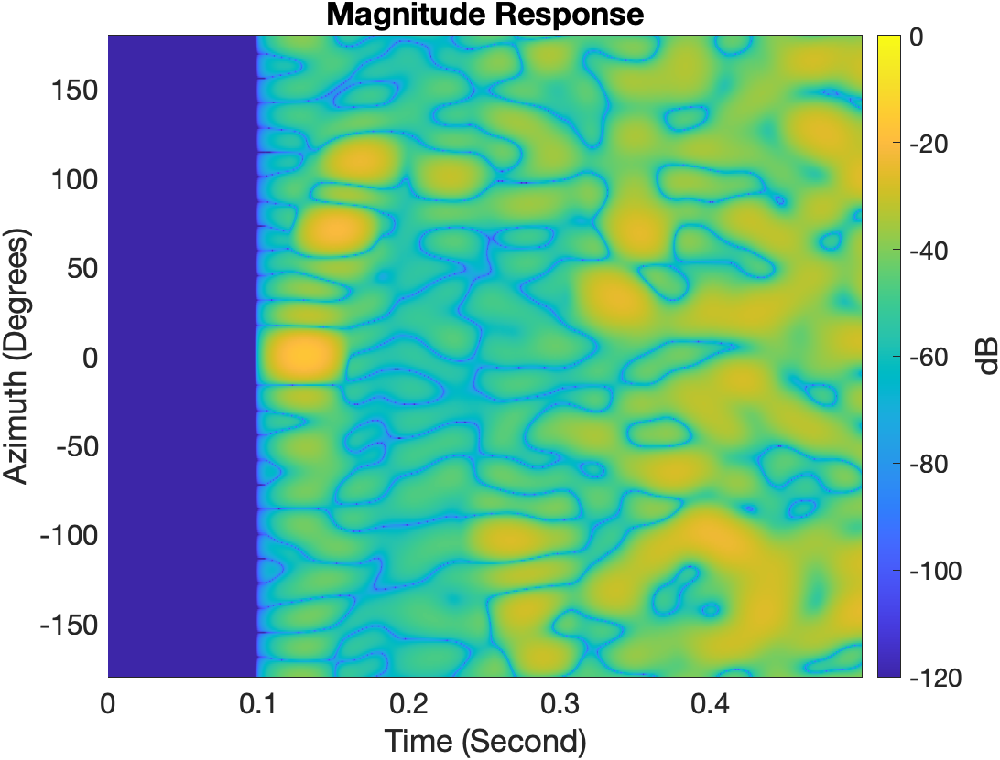|
  |Exponential Scattering|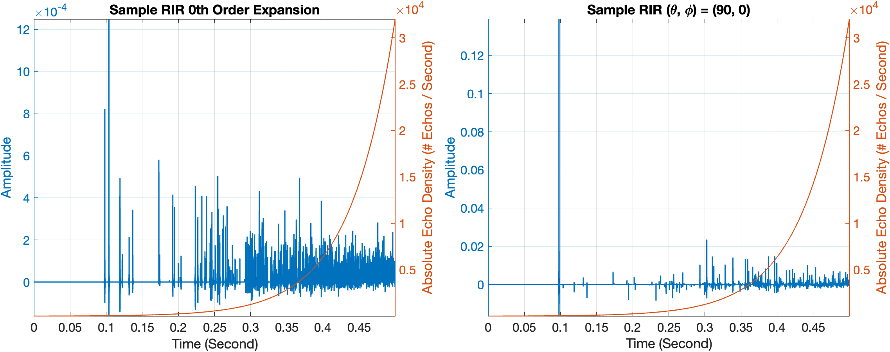|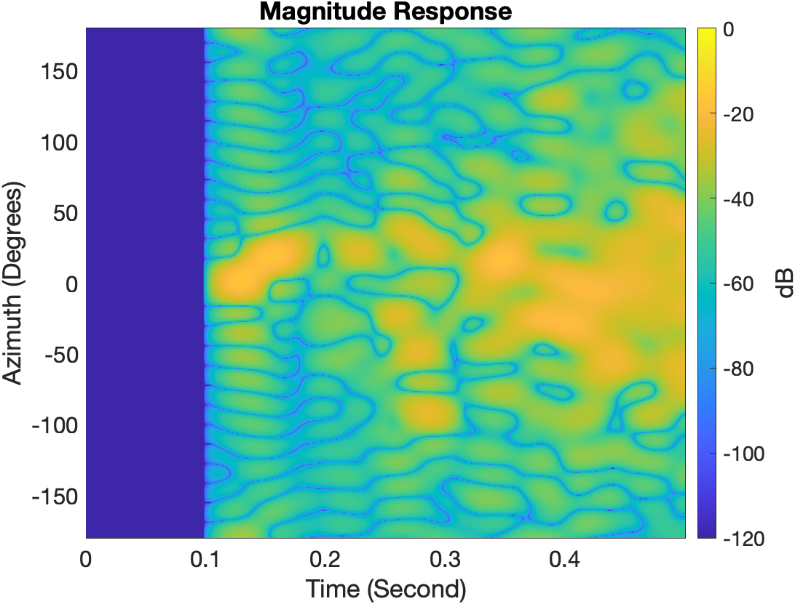| 

    where we expect the majority of the energy in the SRIR to concentrate on-axis in the no scattering case, energy to rapidly disperse in the linear scattering, and slowly disperse in the exponential scattering.

* Specify a T60 GP prior mean and covariance. Set the T60 sampling method to only the GP prior mean function (direction independent, `sample_method_gp = ‘mean’; obs = []`) and apply SH exponentiated convolutions to the exponential scattered SRIR `C_pp_exp_T60_prior` via `sh_exp_conv_gp.m`. Then add a set of observed T60 to `obs` and repeat for the posterior 'C_pp_exp_T60_post':
  ```
  %%%%%%%%%%%%%%%%%%%%%%%%%%%%%%%%%%%%%%%%%%%%%%%%%%%%%%%%%%%%%%%%%%%%%%%%%%%%
  % Specify GP mean and coariance priors
  %%%%%%%%%%%%%%%%%%%%%%%%%%%%%%%%%%%%%%%%%%%%%%%%%%%%%%%%%%%%%%%%%%%%%%%%%%%%
  options_mu  = gp_mu_opts('mu_func', 'power', 'mu_alpha', 0.5, 'mu_beta', 0.1);
  options_cov = gp_cov_opts('cov_sigma', 0.25, 'cov_gamma', 0.75, 'cov_ell', 343);
  
  options_disp_gp = gp_disp_opts('disp_legend_samples', false, ...
      'disp_legend_mean', false, 'disp_legend_var', false, 'disp_legend_loc', 'southwest', ...
      'disp_legend_num_cols', 1, 'disp_ylim', [0, 0.8], ...
      'disp_sample_eval', true, 'disp_mean', false, 'disp_var', true, ...
      'disp_legend_compact', true, 'disp_position', [100, 100, 560 * 0.825, 480 * 0.666], ...
      'disp_legend_transparency', 0.75, 'disp_colororder', 'gem12', ...
      'disp_var_transparency', 0.025, ...
      'disp_sample_stride', 1);
  
  sample_method_gp = 'mean';
  
  SH_fit_mode = 'svd_ls';
  N_freq_uni_fit = 24;
  max_taps_g = 24;
  
  % Sample fromr T60 prior mean
  obs = [];
  [C_pp_exp_T60_prior, h_fig_gp_prior] = sh_exp_conv_gp(C_pp_exp, obs, is_real, ...
      'Fs', Fs, 'options_mu', options_mu, 'options_cov', options_cov, ...
        'max_odr_gp', 3, 'sample_method_gp', sample_method_gp, ...
        'N_freq_uni_fit', N_freq_uni_fit, 'max_taps_g', max_taps_g, ...
        'SH_fit_mode', SH_fit_mode, 'SH_fit_svd_trunc_frac', 0, ...
        'enable_disp', true, 'options_disp_gp', options_disp_gp);
  
  % Sample from T60 posterior mean
  N_S = 16;
  omega_obs = logspace(log10(20), log10(Fs/2), N_S)' * 2 * pi;
  obs = gp_obs_opts(  'omega', omega_obs, ...
                      'theta', deg2rad(90) * ones(N_S, 1), ...
                      'phi', deg2rad(0) * ones(N_S, 1), ...
                      'T60', mu_pow(omega_obs, 0.5, 0), ...
                      'log_noise_std', 0.005 * ones(N_S, 1) ... %0.5 percent
                      );
  
  [C_pp_exp_T60_post, h_fig_gp_post] = sh_exp_conv_gp(C_pp_exp, obs, is_real, 'Fs', Fs, 'options_mu', options_mu, 'options_cov', options_cov, ...
        'max_odr_gp', 3, 'sample_method_gp', sample_method_gp, ...
        'N_freq_uni_fit', N_freq_uni_fit, 'max_taps_g', max_taps_g, ...
        'SH_fit_mode', SH_fit_mode, 'SH_fit_svd_trunc_frac', 0, ...
        'enable_disp', true, 'options_disp_gp', options_disp_gp);
  ```
  | T60 GP Prior | T60 GP Posterior|
  | --- |--- |
  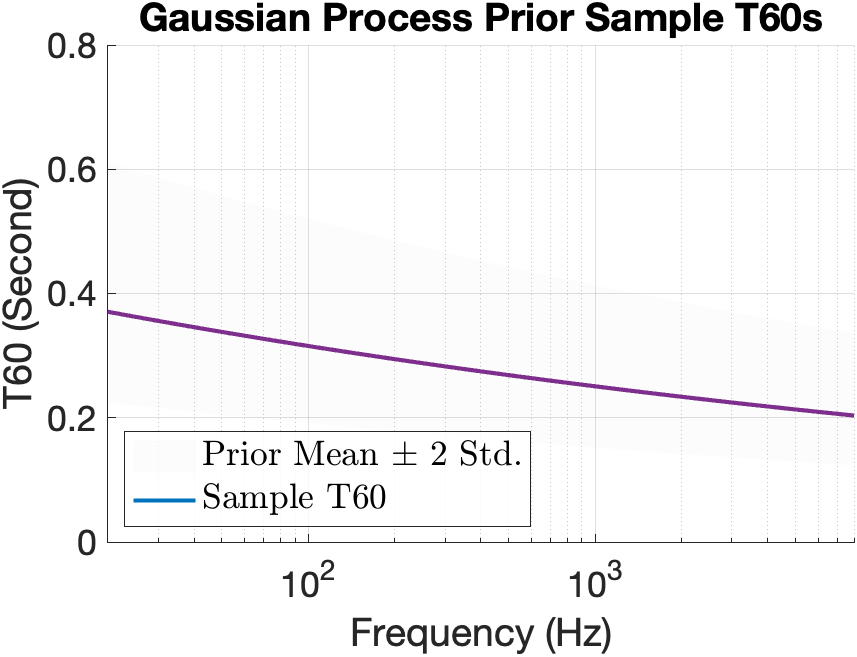 | 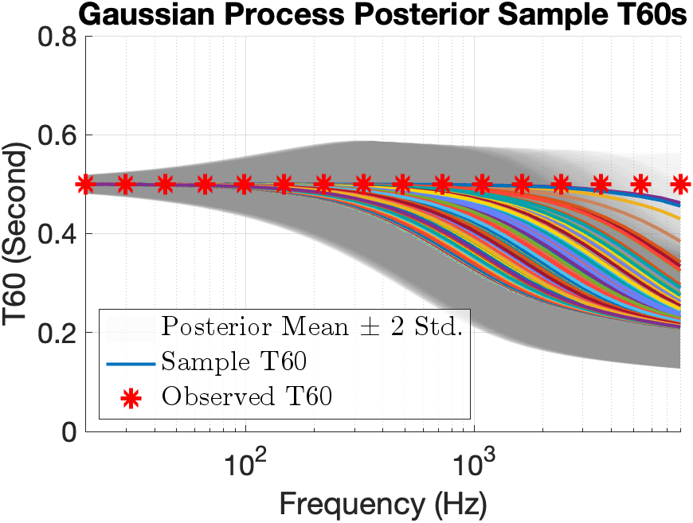

* Decode and plot SRIRs at spherical coordinates on the horizontal plane:

  ```
  %%%%%%%%%%%%%%%%%%%%%%%%%%%%%%%%%%%%%%%%%%%%%%%%%%%%%%%%%%%%%%%%%%%%%%%%%%%%
  % Decode along grid and plot
  %%%%%%%%%%%%%%%%%%%%%%%%%%%%%%%%%%%%%%%%%%%%%%%%%%%%%%%%%%%%%%%%%%%%%%%%%%%%
  theta_cust = deg2rad([90 90 90 90])';
  phi_cust = deg2rad([0 60 120 180])';
  N_cust = numel(theta_cust);
  
  f_cust_orig     = real(sh_dec(C_pp_exp, theta_cust, phi_cust, is_real));
  f_cust_prior    = real(sh_dec(C_pp_exp_T60_prior, theta_cust, phi_cust, is_real));
  f_cust_post     = real(sh_dec(C_pp_exp_T60_post, theta_cust, phi_cust, is_real));
  
  h_f_cust_dec = cell(3, N_cust);
  
  yticks_list = [250, 1000, 4000] / 1000;
  
  for n = 1:N_cust
      options_plot_RIR = plot_RIR_opts('Fs', Fs, 'colormap', hot, 'disp_RIR', false, ...
          'win_size', 64, 'N_FFT', 512, ...
          'spec_disp_colorbar', true, 'spec_title_interp', 'latex', ...
          'spec_disp_yaxis', true, 'fig_size', [600, 300] * (3/4), ...
          'spec_ylim', [50, inf], 'font_size', 18, 'clim', [-160, -50], ...
          'name', ['$(\theta = ',  num2str(rad2deg(theta_cust(n))), '^{\circ}, \phi = ',  num2str(rad2deg(phi_cust(n))), '^{\circ})$'] );
  
      h_f_cust_dec{1, n} = plot_RIR(f_cust_orig(n, 1:ceil(0.5 * Fs))', options_plot_RIR);  yticks(yticks_list);
      h_f_cust_dec{2, n} = plot_RIR(f_cust_prior(n, 1:ceil(0.5 * Fs))', options_plot_RIR);  yticks(yticks_list);
      h_f_cust_dec{3, n} = plot_RIR(f_cust_post(n, 1:ceil(0.5 * Fs))', options_plot_RIR);  yticks(yticks_list);
  end
  ```

  | Original | Exponentiated SRIR with T60 GP prior| Exponentiated SRIR with T60 GP Posterior|
    | --- | --- |--- |
    |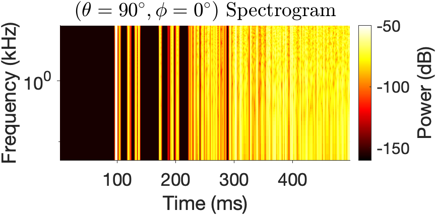|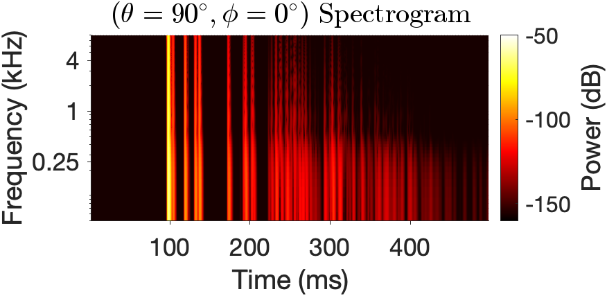|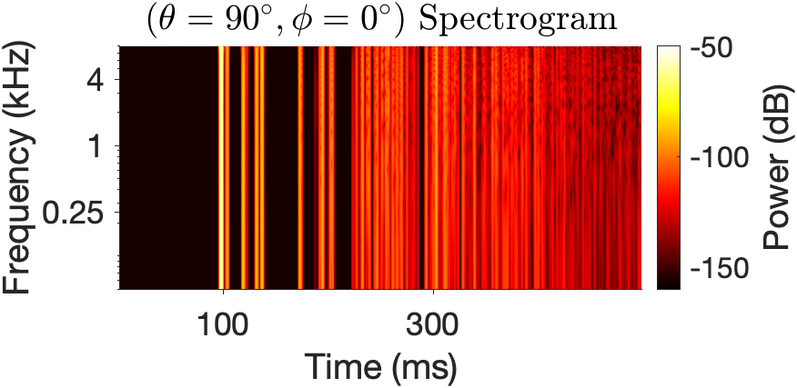|
    |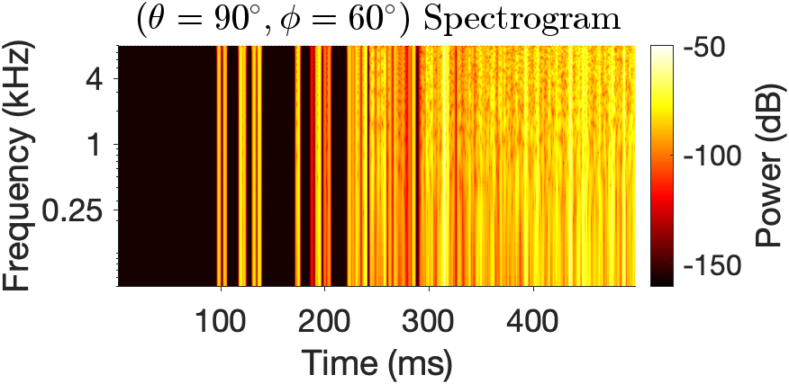|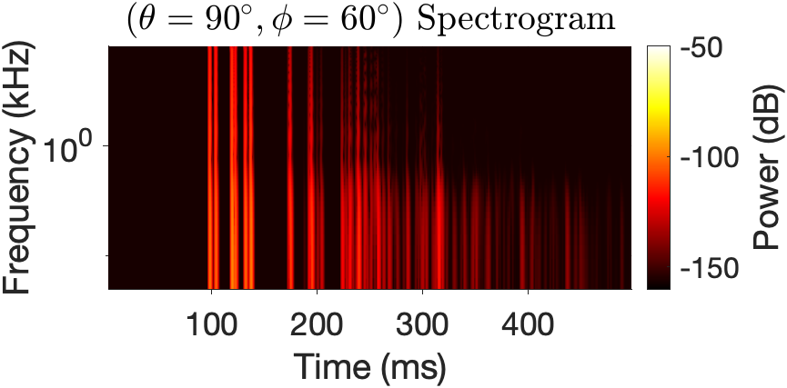|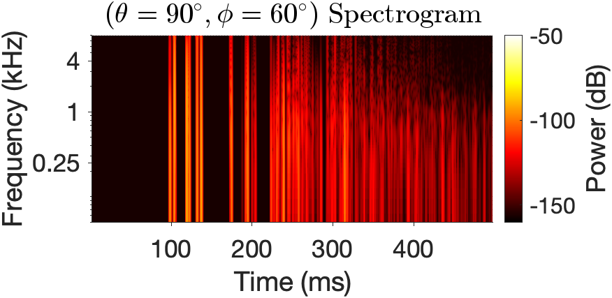|
  |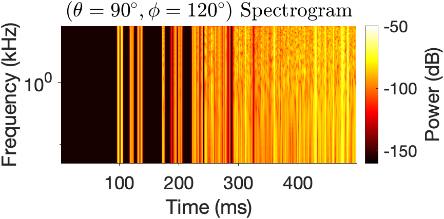|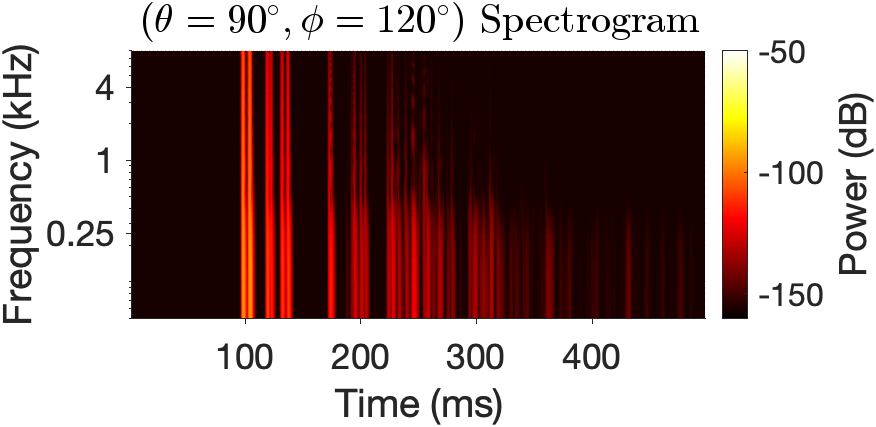|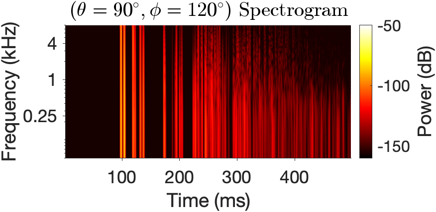|
  |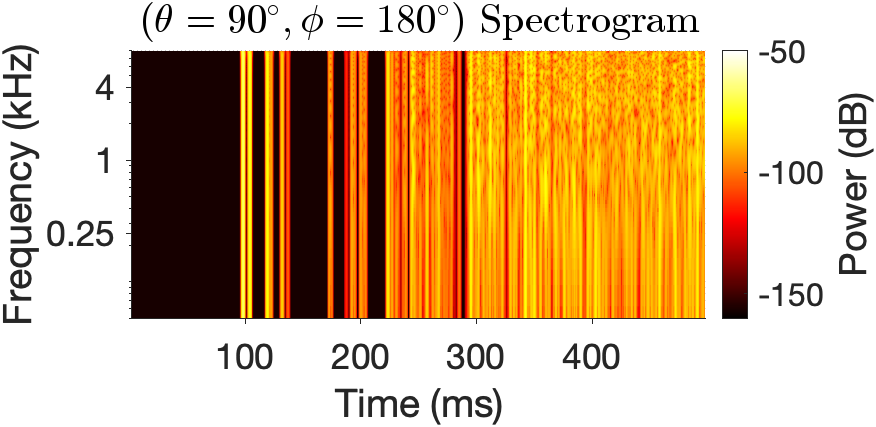|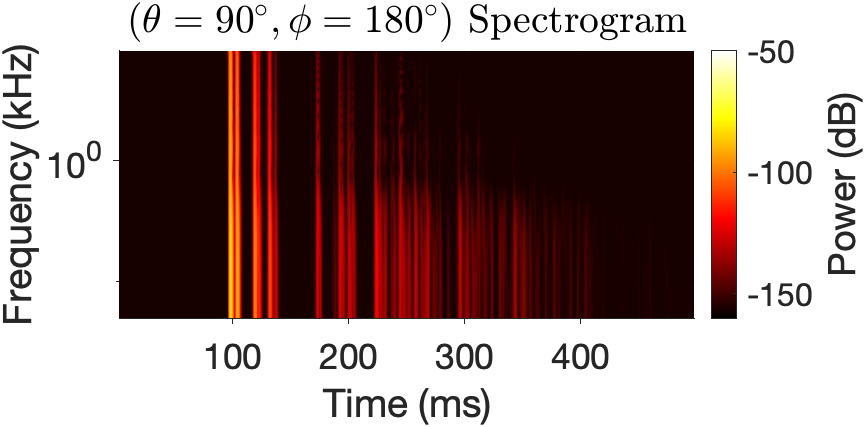|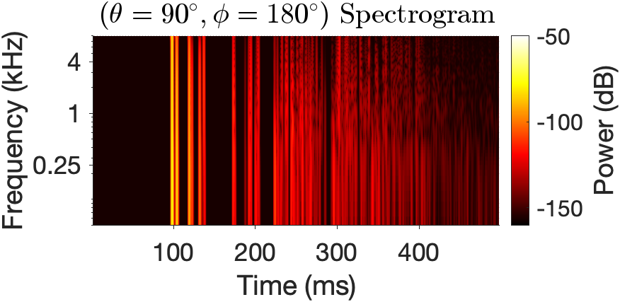|
    
### Spherical Harmonic Image-Source Model

We can further generalize specular reflection models, such as the image-method[^ALLEN_ISM], towards separable applications between the acoustic source and receiver’s directivity, and the room reflections in SH-ISM formulations[^LUO_SHISM]. The room’s acoustic reflections are expanded along all pair-wise SH bases of image-source and image-receiver delta functions in a tensor of size `[(L_S+1)^2 x (L_R+1)^2 x T]` for finite max-order `L_S`, `L_R` respectively over time duration `T` samples. The source and receiver’s far-field directivity are independently expanded along SH bases, and can be arbitrarily rotated as represent different combinations of source and receiver orientations in an augmented dataset. The RIR is therefore realized by left and right multiplying the tensor by rotated SH expansion coefficients of the source and receiver directivity respectively. The SH-ISM model is implemented in the function `sh_ism.m`. 

Let us generate a sample SH-ISM RIR and augment its T60 in the function `plot_sh_ism_example.m`:

* Configure a SH-ISM model with max `L_S=1`, and `L_R=5` source and receiver expansion orders respectively, colorless room reflection coefficients, source/receiver/room coordinates and dimensions, and image coordinate jitter:
  ```
  %%%%%%%%%%%%%%%%%%%%%%%%%%%%%%%%%%%%%%%%%%%%%%%%%%%%%%%%%%%%%%%%%%%%%%%%%%%
  % Generate SH-ISM RIR
  %%%%%%%%%%%%%%%%%%%%%%%%%%%%%%%%%%%%%%%%%%%%%%%%%%%%%%%%%%%%%%%%%%%%%%%%%%%
  Fs = 48000;      % Sample rate
  
  max_src_odr = 1; % Max-order source directivity
  max_rec_odr = 5; % Max-order receiver directivity
  
  is_real = true;
  
  T = 0.5; % Duration
  
  s = [2 0 1]; % Source coordinates
  r = [1 0 1]; % Receiver coordinates
  l = [5 6 3]; % Room dimensions
  
  % Room reflection filters with high-frequency dampening
  % gamma_pos = [0.8, 0.7, 0.5; 0.2, 0.1, 0.3];
  % gamma_neg = [0.9, 0.6, 0.5; 0.1, 0.1, 0.2];
  
  % Room reflection coefficient flat
  gamma_pos = db2mag(-[0.8, 1.5, 1.0]);
  gamma_neg = db2mag(-[0.5, 2.0, 1.5]);
  
  jitter_coord_bnd = [-1e-1, 1e-1]; % Image coordinate's jitter within +- 10 cm
  
  % Generate SH-ISM
  [C, t] = sh_ism(max_src_odr, max_rec_odr, is_real, T, s, r, l, gamma_pos, gamma_neg, ...
      'Fs', Fs, 'jitter_coord_bnd', jitter_coord_bnd);
  
  % Plotting
  h_RIR_0 = real(sh_dec(squeeze(C(1, 1, :)).', pi/2, 0, is_real))';
  h_RIR_onaxis = real(sh_dec(squeeze(C(1, :, :)), pi/2, 0, is_real))';
  
  h_SH_ism_RIR_0 = plot_RIR(h_RIR_0, plot_RIR_opts('clim', [-120, -60] - 10, 'win_size', 512, 'spec_scale', 'linear'));
  h_SH_ism_RIR_onaxis = plot_RIR(h_RIR_onaxis, plot_RIR_opts('clim', [-120, -60], 'win_size', 512, 'spec_scale', 'linear'));
  h_SH_ism_SH_hplane = sh_plt(squeeze(C(1, :, :)), 'horizontal', is_real, 'disp_phase', false, 'dB_lim', [-120, 0], 't', t, 'disp_xaxis_ker_size', 1024);
  ```

  | SRIR 0th to 0th Order SH Source to Receiver Expansion | SRIR 0th Order SH Source to On-Axis Receiver Direction| Energy / Time or 0th Order Source on Horizontal Plane |
  | --- | --- | --- |
  |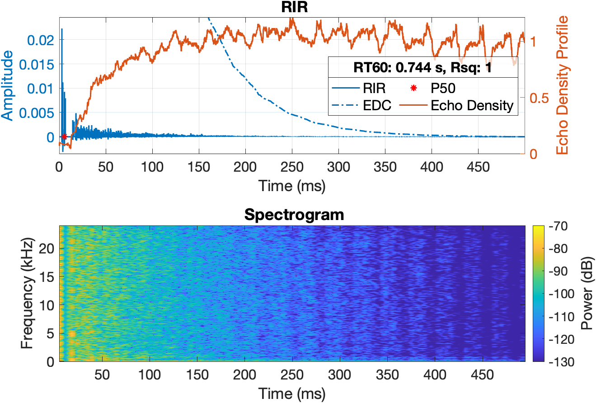|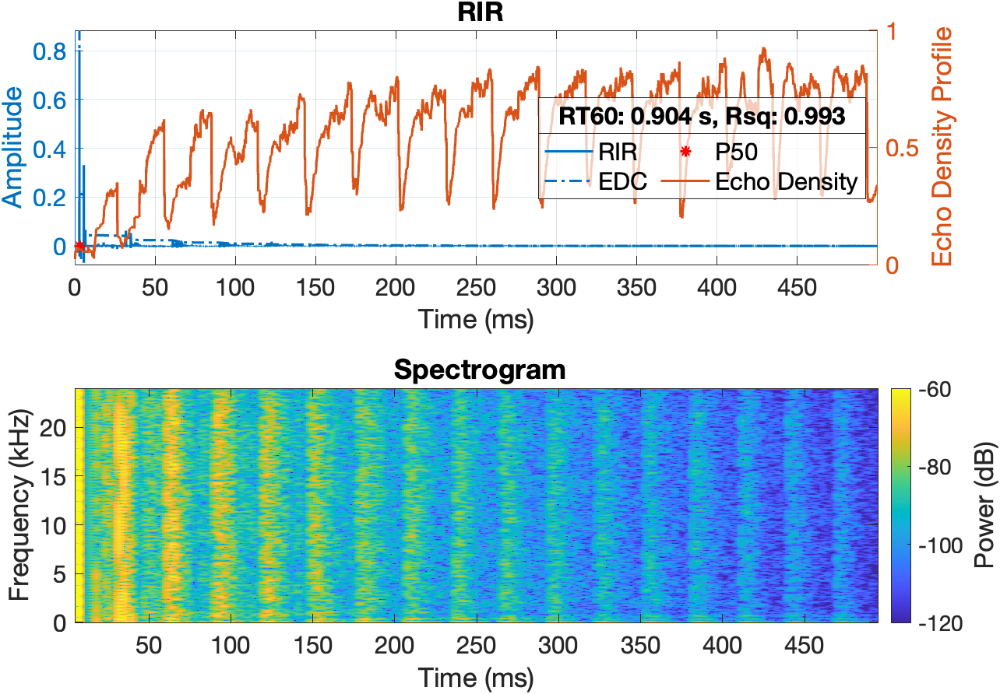|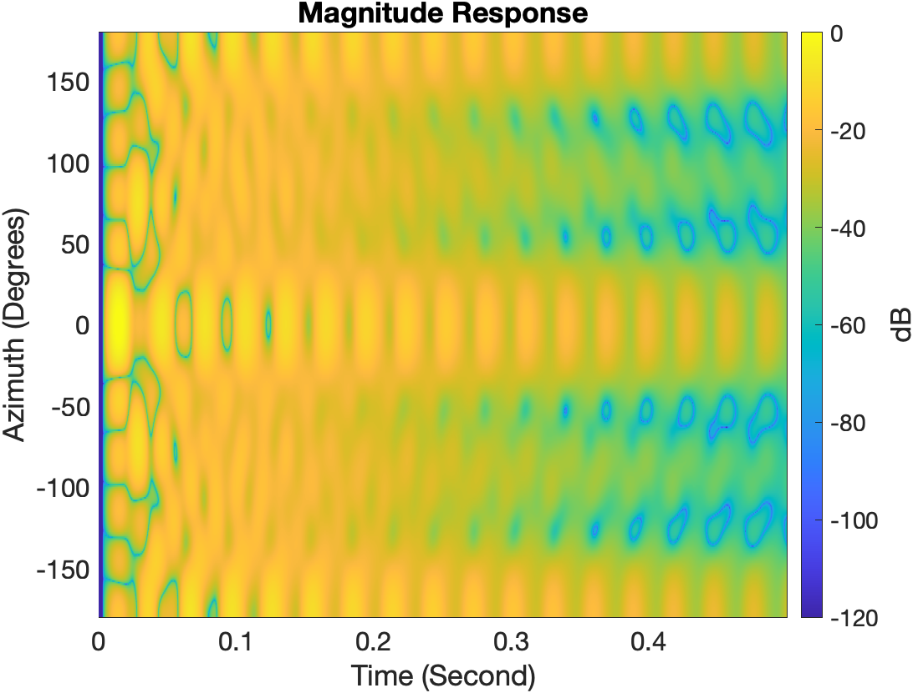|

* Specify a T60 GP prior mean and covariance. Set the T60 sampling method to only the GP prior mean function (direction independent, `sample_method_gp = ‘mean’; obs = []`) and apply SH exponentiated convolutions to the exponential scattered SRIR `C_pp_exp_T60_prior` via `sh_exp_conv_gp.m`. Then add a set of observed T60 to `obs` and repeat for the posterior 'C_pp_exp_T60_post':

    | T60 GP Prior | T60 GP Posterior|
    | --- |--- |
    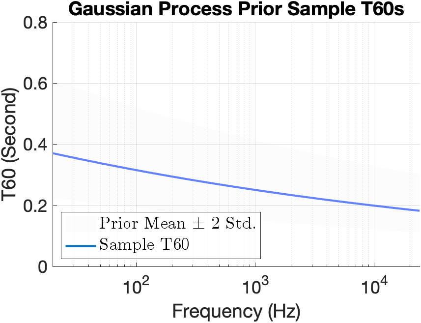 | 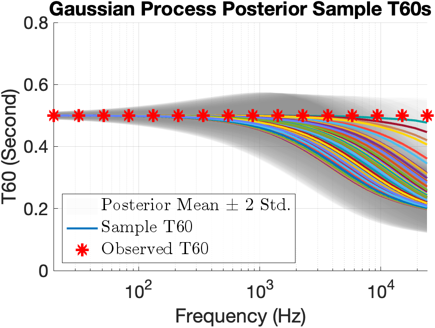

* Decode and plot SRIRs at spherical coordinates on the horizontal plane:

  ```
  %%%%%%%%%%%%%%%%%%%%%%%%%%%%%%%%%%%%%%%%%%%%%%%%%%%%%%%%%%%%%%%%%%%%%%%%%%%%
  % Decode along grid and plot
  %%%%%%%%%%%%%%%%%%%%%%%%%%%%%%%%%%%%%%%%%%%%%%%%%%%%%%%%%%%%%%%%%%%%%%%%%%%%
  theta_cust = deg2rad([90 90 90 90])';
  phi_cust = deg2rad([0 60 120 180])';
  N_cust = numel(theta_cust);
  
  f_cust_orig     = real(sh_dec(squeeze(C(1, :, :)), theta_cust, phi_cust, is_real));
  f_cust_prior    = real(sh_dec(C_sh_ism_T60_prior, theta_cust, phi_cust, is_real));
  f_cust_post     = real(sh_dec(C_sh_ism_T60_post, theta_cust, phi_cust, is_real));
  
  h_f_cust_dec = cell(3, N_cust);
  
  yticks_list = [250, 1000, 4000, 8000, 16000] / 1000;
  
  for n = 1:N_cust
      options_plot_RIR = plot_RIR_opts('Fs', Fs, 'colormap', hot, 'disp_RIR', false, ...
          'win_size', 64, 'N_FFT', 512, ...
          'spec_disp_colorbar', true, 'spec_title_interp', 'latex', ...
          'spec_disp_yaxis', true, 'fig_size', [600, 300] * (3/4), ...
          'spec_ylim', [100, inf], 'font_size', 18, 'clim', [-160, -50], ...
          'name', ['$(\theta = ',  num2str(rad2deg(theta_cust(n))), '^{\circ}, \phi = ',  num2str(rad2deg(phi_cust(n))), '^{\circ})$'] );
  
      h_f_cust_dec{1, n} = plot_RIR(f_cust_orig(n, 1:ceil(0.5 * Fs))', options_plot_RIR); yticks(yticks_list);
      h_f_cust_dec{2, n} = plot_RIR(f_cust_prior(n, 1:ceil(0.5 * Fs))', options_plot_RIR); yticks(yticks_list);
      h_f_cust_dec{3, n} = plot_RIR(f_cust_post(n, 1:ceil(0.5 * Fs))', options_plot_RIR); yticks(yticks_list);
  end
  ```
  
| Original | Exponentiated SRIR with T60 GP prior| Exponentiated SRIR with T60 GP Posterior|
  | --- | --- |--- |
  |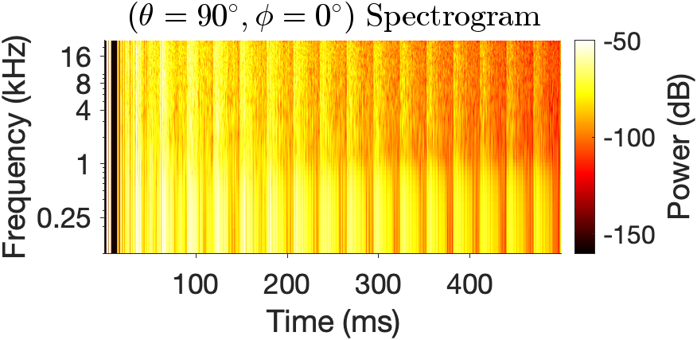|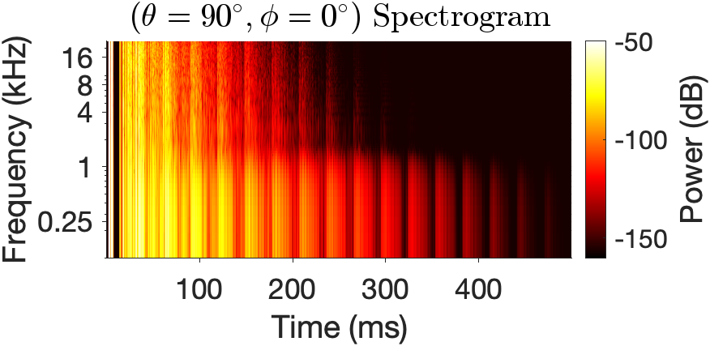|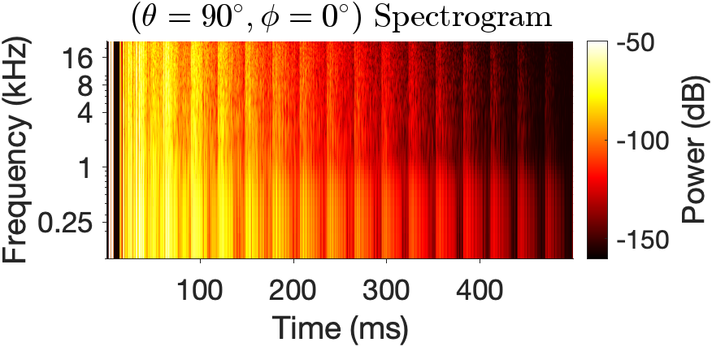|
  |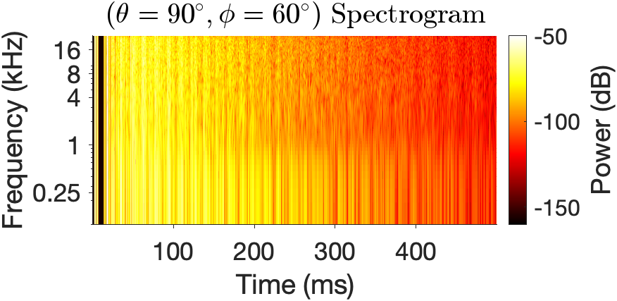||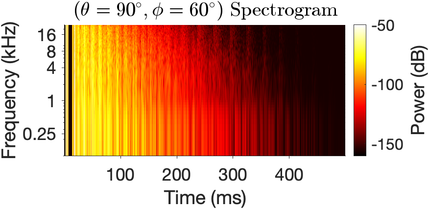|
||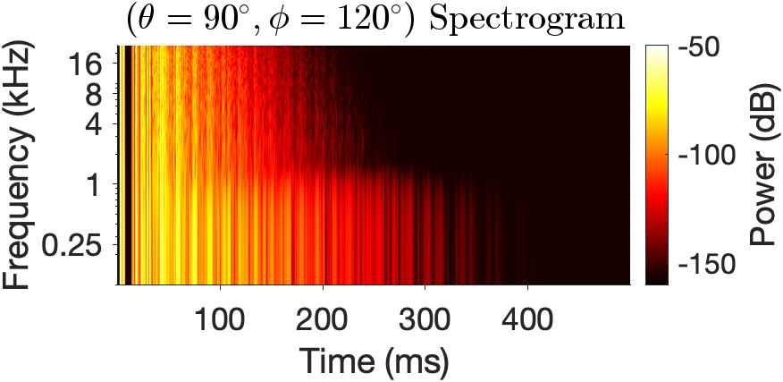|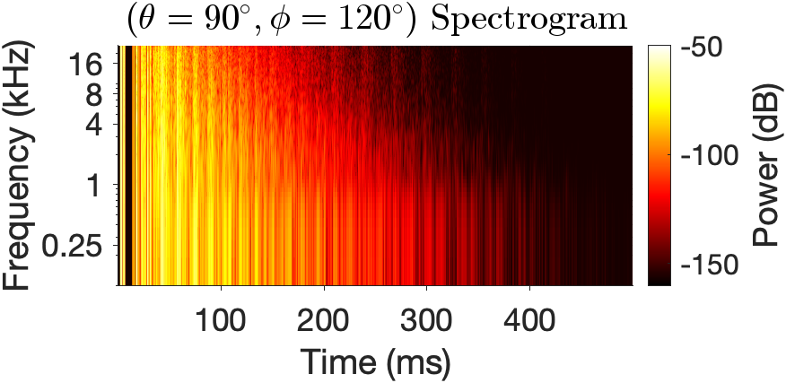|
|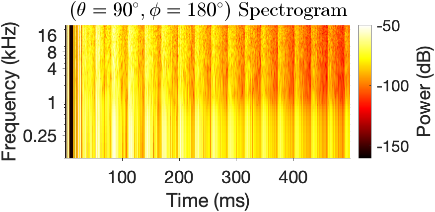||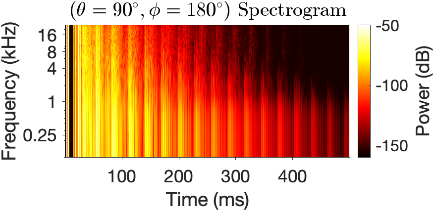|


[^PACIOREK_NS]: Paciorek, C., & Schervish, M. (2003). "Nonstationary covariance functions for Gaussian process regression". Advances in neural information processing systems, 16.

[^OPPENHEIM_DSP]: Oppenheim, Alan V., and Ronald W. Schafer. (1999). "Discrete-time signal processing.”.

[^ABEL_EDP]: Abel, J. And Huang, P. (2006). "A simple, robust measure of reverberation echo density". Journal of the Audio Engineering Society.

[^HUANG_EDP]: Huang, P. and Abel, J.S., (2007, October). "Aspects of reverberation echo density". Audio Engineering Society Convention 123. Audio Engineering Society.

[^LUO_MAGSQSH]: Luo, Y. (2021). "Spherical harmonic covariance and magnitude function encodings for beamformer design". EURASIP Journal on Audio, Speech, and Music Processing, 2021(1), 41.

[^ALLEN_ISM]: Allen, J. B., & Berkley, D. A. (1979). "Image method for efficiently simulating small‐room acoustics". The Journal of the Acoustical Society of America, 65(4), 943-950.

[^LUO_SHISM]: Luo, Y., & Kim, W. (2020). "Fast source-room-receiver acoustics modeling". In 2020 28th European Signal Processing Conference (EUSIPCO) (pp. 51-55). IEEE.